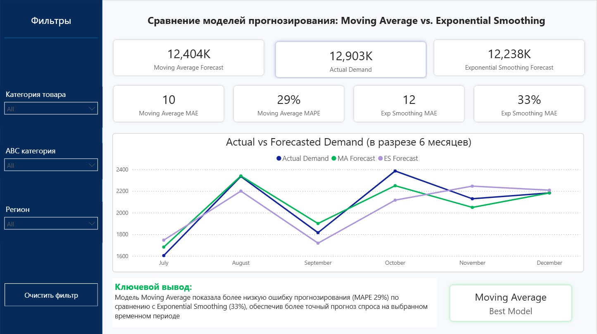
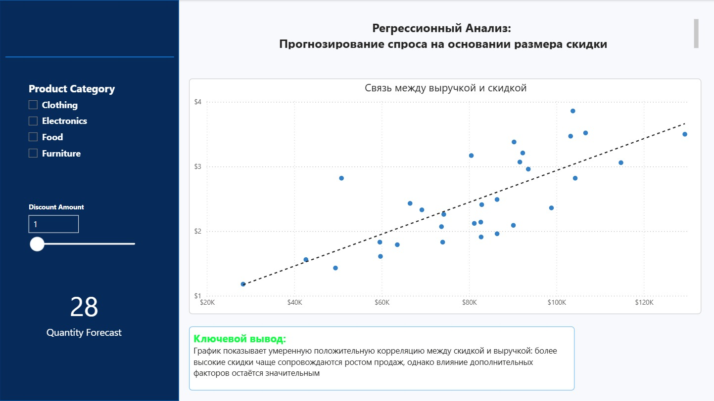

# demand-forecasting-dashboard
Forecasting models comparison SQL + Power BI

Анализ моделей прогнозирования спроса

**Цель проекта**

— проанализировать продажи, сегментировать товары по значимости и сравнить модели прогнозирования спроса для поддержки бизнес-решений

В рамках проекта были выполнены:

- ABC-анализ товаров

- прогнозирование продаж с помощью:

- Moving Average

- Exponential Smoothing

- сравнение моделей по метрикам MAE и MAPE

- регрессионный анализ влияния скидок на объём продаж

- визуализация результатов в Power BI

**Бизнес-задача**

Бизнес сталкивается с высокой нестабильностью спроса, из-за чего сложно:

- планировать закупки

- управлять товарными запасами

- оценивать эффективность скидок

- прогнозировать продажи на будущие периоды

Задача проекта — определить более подходящую модель прогнозирования и выявить факторы, влияющие на продажи

**Используемые инструменты**

- SQL

- Power BI

- DAX

- Moving Average

- Exponential Smoothing

- Regression Analysis

- MAE / MAPE

**Этапы работы**

**1. Подготовка данных в SQL**

В SQL были выполнены:

- агрегация продаж по периодам

- расчёт Moving Average

- расчёт Exponential Smoothing

- ABC-анализ товаров

**2. Сравнение моделей прогнозирования**

Для оценки качества прогнозов использовались:

- MAE (Mean Absolute Error)

- MAPE (Mean Absolute Percentage Error)

Сравнение позволило определить модель с меньшей ошибкой прогнозирования.

**3. Регрессионный анализ**

Была построена регрессионная модель для анализа зависимости:

X — размер скидки

Y — объём продаж (quantity)

Цель — определить, насколько увеличение скидки влияет на рост продаж.

**Power BI Dashboard**

В дашборде представлены:

- сравнение моделей прогноза

- ABC-сегментация товаров

  

- анализ влияния скидок

  

**Ключевые выводы**

- Спрос имеет нестабильный характер, что усложняет прогнозирование

- Моедль Moving Average показала более низкие ошибки MAE и MAPE

- Небольшая часть товаров формирует основную долю выручки

- Рост скидки не всегда приводит к пропорциональному росту продаж

**Бизнес-рекомендации**

- Сфокусировать контроль запасов на товарах категории A

- Использовать модель с меньшей ошибкой для краткосрочного прогнозирования - Moving Average

- Пересмотреть скидочную стратегию для отдельных категорий товаров
